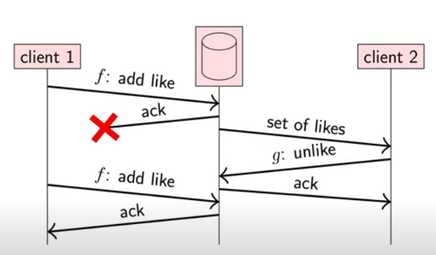
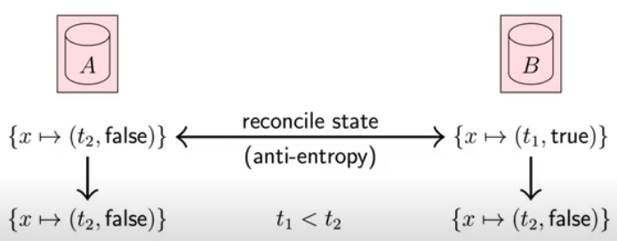
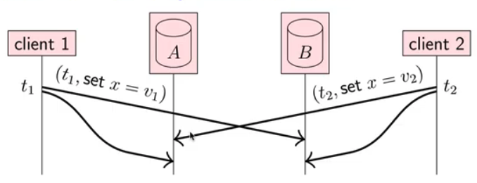
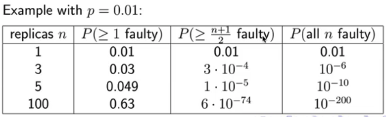
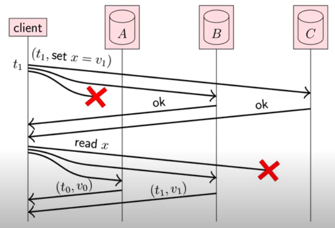
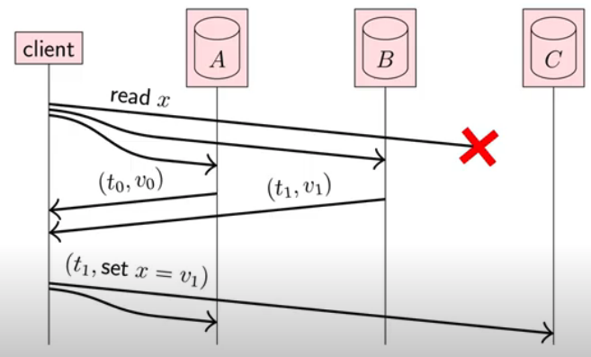
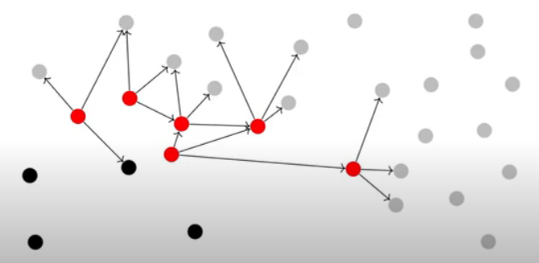
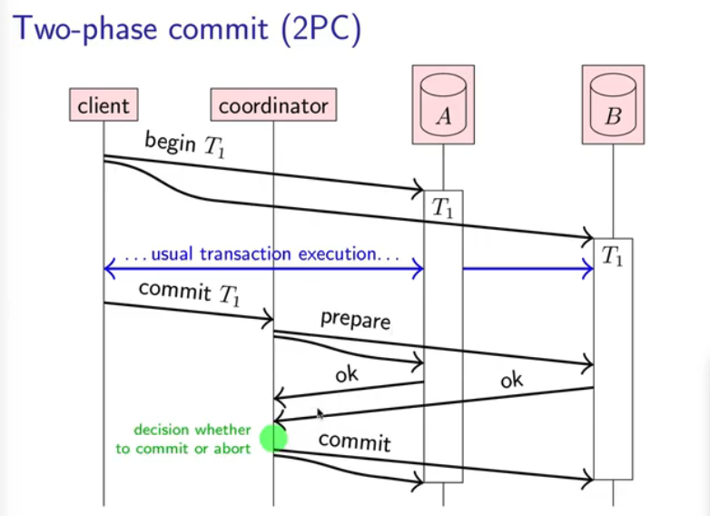

# System, Node, Network

## System Behaviors

以下為System在不同狀況下，有可能產生的Behaviors。我們分成三部分討論：  
\(1\) Network Behaviors  
\(2\) Nodes Behaviors  
\(3\) Timing Behaviors

### 1. Network Behavior

Assume bidirectional point-to-point communication between nodes with one of the following network behavior:

* **Reliable** \(perfect\) links Message is received, message may be reordered.             &lt; ---- \|
* **Fair-Loss** links                                                                                  \| retry + de-duplicate Messages may be lost, duplicated, or reordered.                ---- \| If you keep retrying, a message eventually gets through. &lt;---\|cryptographic protocol
* **Arbitrary** links                                                                                 \|  **TLS \(Transport** A malicious adversary may interfere with messages.        -----\|     **Layer Security\)** \(eavesdrop, modify, drop, spoof, replay\)

Network Partition: some links dropping/delaying all messages for extended period of time.

### 2. Node Behavior

A node that is not faulty is called '`correct node`', otherwise the node could be faulty. Each node executes a specified algorithm, with the following node behavior: 

* **Crash-Stop** \(fail-stop\) A node is faulty if it crashes, and never gets recovered.
* **Crash-Recovery** \(fail-recovery\) A node may crash at any moment, losing its in-memory state. But it may resume executing sometime later.
* **Byzantine** \(fail-arbitrary\) A node is faulty if it behaves abnormal/deviates from the algorithm. Such as crashing, malicious behavior.

### 3. Timing/Synchrony Behavior

Between network and nodes, timing part will have the following behavior:  

* **Synchronous** Message latency is not greater than a known upper bound. Nodes execute algorithm at a known speed.
* **Partially Synchronous** Sometime async, sometime sync.
* **Asynchronous** Messages can be delayed arbitrarily. Nodes can pause execution arbitrarily.  No timing guarantees at all.

**What kind of situations could increase asynchrony/latency? sync -&gt; async**  
In network:  
\(1\) Message loss requiring **retry**  
\(2\) **Congestion/contention** causing queuing  
\(3\) **Network/route reconfiguration**   
  
In nodes:  
\(1\) Operating system **scheduling issue**   \(e.g. priority inversion\)  
\(2\) Stop-the-world **garbage collection pauses**  
\(3\) Page faults, swap, thrashing

<table>
  <thead>
    <tr>
      <th style="text-align:left"></th>
      <th style="text-align:left">Summary</th>
    </tr>
  </thead>
  <tbody>
    <tr>
      <td style="text-align:left"></td>
      <td style="text-align:left">
        <p><b>Network Behavior</b>
        </p>
        <ul>
          <li>Reliable</li>
          <li>Fair-Loss</li>
          <li>Arbitrary</li>
        </ul>
      </td>
    </tr>
    <tr>
      <td style="text-align:left"></td>
      <td style="text-align:left">
        <p><b>Nodes Behavior</b>
        </p>
        <ul>
          <li>Crash-Stop</li>
          <li>Crash-Recovery</li>
          <li>Byzantine</li>
        </ul>
      </td>
    </tr>
    <tr>
      <td style="text-align:left"></td>
      <td style="text-align:left">
        <p><b>Timing Behavior</b>
        </p>
        <ul>
          <li>Synchronous</li>
          <li>Partially Synchronous</li>
          <li>Asynchronous</li>
        </ul>
        <p>What kind of issues could increase latency?</p>
        <p>In network
          <br />(1) message loss, need retry</p>
        <p>(2) network congestion</p>
        <p>(3) network reconfig</p>
        <p></p>
        <p>In nodes</p>
        <p>(1) scheduling/priority issue
          <br />(2) garbage collection caused pause
          <br />(3) page faults...</p>
      </td>
    </tr>
  </tbody>
</table>

## 2. Network

### 2-1. Latency and Bandwidth

#### Latency

**What is Latency \(延遲性\)?**  
Latency is 1\) **time until a message arrives**.   
                   2\) the time it takes to communicate from one device to another.

* In the same building/data center: ~ 1ms
* One continent to another: ~ 100ms
* Hard drives in a van: ~ 1 day

#### Bandwith

**What is Bandwith \(可乘載的量\)?**  
Bandwith is **data volume per unit time.**

* 3G cellular data: ~ 1 Mb/s
* Home broadband: ~ 10 Mb/s
* Hard drives in a van:  50 TB/box ~ 1Gb/s 

### 2-2. How HTTP uses TCP

**How does TCP send data via the Internet?**  
TCP sends network packets \(each packet is a small size.\)   
HTTP uses TCP underneath. \(Request\) TCP breaks down these big messages, into small network packets that are small enough that the network can deliver them. And then on the recipient side \(Response\), TCP puts all of the network packets back again to give us one large chunk of bytes.

### 2-3. TCP vs UDP

**TCP -**   
**UDP - User Data Protocol**  
如何決定要用TCP vs UDP? 有以下關鍵點

* **Low Latency重要** \(e.g. real-time gaming like LoL, DOTA\) 如果low latency在傳輸中重要，那就使用UDP。 UDP丟包不會再重發，因此不會有回傳的ack阻塞channel。 
* **High Consistency重要**  資料傳輸一致 \(e.g. financial transaction system\)  

### 2-4. RPC - Remote Procedure Call  

Ideally, RPC makes a call to a remote function look the same as a local function call. 

#### RPC in Enterprise Systems

**Service Oriented Architecture \(SOA\) / "microservices"**  
SOA meaning splitting a large software application into multiple services \(on multiple nodes\) that communicate via RPC. 


### 2-9. HTTP

### HTTP Status Code

1. Informational responses \(`100`–`199`\)
2. Successful responses \(`200`–`299`\)
3. Redirects \(`300`–`399`\)
4. Client errors \(`400`–`499`\)
5. Server errors \(`500`–`599`\)



## 3. Node&Sync: Why Replication?

What does replication means?  
\# Keeping a copy of the same data on multiple nodes \(e.g. DBs, filesystems, caches\)  
\# A node that has a copy of the data is called a **replica**.  
\# If some replicas are faulty, others are still accessible  
\# Replication spread load across many replicas

> Note: Learn RAID \(Redundant Array of Independent Disks\)

### Retrying State Updates

### 3-1. Achieve Consistency

**Why do we need to achieve consistency?**  
When clients make the same call/click repeatedly, the results should be the same. Meaning multiple request should have the same effect as making a single request. \(aka "exactly-once delivery"\)  
  
**How do we achieve eventual consistency? \(後面會說明\)**  
There are three common techniques to achieve eventual consistency:   
\(1\) **read-repair**  
\(2\) **write-repair**  
\(3\) **asynchronous repair**

### 3-2. Idempotence \(冪等性\)   \*\*\*\*\*很重要\*\*\*\*\*

**用於：API Design  
  
定義，什麼是Idempotent?**  
If you apply a function once to some argument, it has the same effect as applying twice or three times or any number of times.  
  
**\* Not idempotent:** increment a counter --&gt; ****$${f(likeCount) = likeCount + 1}$$   
**\* Idempotent:** add an element to a set --&gt;$${f(likeSet) = likeSet \cup userID}$$   
  
**為什麼要Idempotent?**   
目的為deduplication。使其在retry但沒ack情況下，減少系統所產生的duplication。

### 3-3. Retry Semantics

有以下幾種辦法Retry

* **At-most-once** semantics: send request, don't retry, update may not happen
* **At-least-once** semantics retry request until ack\(acknowledged\), may repeat update
* **Exactly-once** semantics retry + idemopotence or deduplication

### 3-4. Reconcile Replicas

利用timestamp來記錄先後順序，使其在inconsistent時，能自動更新。

#### Problem on Idempotency - While Adding & Removing

在ClientA, ClientB同時修改DB時，Idempotent會發生問題，如下圖。因此，我們需要利用**Timestamp + Tombstone**的方式，來確保event先後順序和狀態。




"Remove x" doesn't actually remove x: it labels x with "false" to indicate it is invisible \(a tombstone\). Every record has **logical timestamp\(t1,t2\)** of last write.   
  
How to check latest DB state between different DBs?   
We **reconcile replicas** by periodically communicate among themselves like below.



### 3-5. Concurrent Writes by Different Clients



問題：當不同的Clients\(Client1, Client2\)想要同時修改databaseA, databaseB時，會出現**Concurrent Write**的情況。Concurrent Write如何解決？下面兩種是常見的方法：

* Last-Writer Wins \(LWW\) - 但有可能會data loss
* Multi-Value Register

### 3-6. Tech Library to Solve Idempotency

There's a general purpose idempotency library called "**Orpheus**". Orpheus is the Greek mythological hero who was able to orchestrate and charm all living things.   
  
Orpheus Library Benefits:   
\* offers low latency  
  
Orpheus Idemptency Library consists with the following concepts:  
\(1\) **Idempotency key** is passed into the framework, representing a idempotent request.  
\(2\) Idempotency information is read and written from **sharded master database \(for consistency\)**  
\(3\) Database transactions are combined in different parts of the codebase to ensure **atomicity**, using Java lambdas.   
\(4\) Error responses are classified as "retryable" or "non-retryable"

## 3. Node&Sync: Solving Prob of Faults - Quorum \(法定人數\)

**為什麼需要Quorum?**   
通常Node數量一多，便有機率會出現node crash的情況。Node Crash會造成inconsistency = data not consistent。此時便需要利用Quorum來決定數據的真實性。

**Probability of Node Faults**  
當Node/Replicas數量越多，就  
\(1\) 越有可能出現One Node Crash --&gt; decrease consistency  
\(2\) 越不可能出現All Nodes Crash  --&gt; increase reliability



### 3-7. How Quorum Works 



> #### Data in DB needs to be consistent

What do we do to achieve **Read After Write Consistency**?  
Use **Read and Write Quorum.**  
意即Read Quorum去看一批nodes，Write Quorum去看另外一批nodes。只要majority quorums同意，那就是正確值。  
  
Write Quorum: write is acknowledged by $$w$$ replicas  
Read Quorum: read is acknowledged by $$r$$ replicas  
and $$r + w > n$$   
  
**Majority Quorum**: $$r = w = \frac {n+1} {2} $$ for n = 3, 5, 7...  
Reads Quorum can tolerate $$n - r$$ unavailable replicas   \(e.g. 5 - 2\)  
Writes Quorum can tolerate $$n - w$$ unavailable replicas  \(e.g. 5 - 2\)  


利用投票的方式，來決定哪個數據是真實的。Quorum有三種方式解決eventual consistency的問題  
\(1\) Read Repair  
\(2\) Write Repair  
\(3\) Asynchronous Repair

#### Read Repair

利用Client Read的方式，Client回傳正確值給inconsistent DB，來修復eventual consistency。  
Update \(t1,v1\). Why?   
Because \(t1,v1\) is more recent than \(t0, v0\) since t0 &lt; t1. Client helps propagate \(t1,v1\) to other replicas.



### 3-8. Utilize Broadcast Protocols - State Machine Replication

**We can use broadcast protocols to do replication**.   
The way we do broadcast is to use total order broadcast, where every node **delivers the** **same messages** in the **same order**.

#### **State Machine Replication \(SMR\):**

* FIFO-total order broadcast every update to all replicas \(same update in same order\)
* Replica delivers update message: apply it to own state
* **Applying an update is** **deterministic**
* Replica is a **state machine**: starts in fixed initial state, goes through the same sequence of state transitions in the same order --&gt; all replicas end up in the same state      

```python
State Machine Replication 

for u in request to perform update u:
    send u via FIFO-total order broadcast

for u in delivering u through FIFO-total order broadcast:
    update state using arbitrary deterministic logic    
```

**Ideas** that uses State Machine Replication Methodology:  
\(1\) serializable transactions   
\(2\) blockchains, distributed ledgers, smart contracts  
  
**Limitations:**  
\(1\) ****Cannot update state immediately, have to wait for delivery through broadcast  
\(2\) Need fault-tolerant total order broadcast

**Replication Using Different Broadcasts**  
Updates f and g are commutative where f\(g\(x\)\) = g\(f\(x\)\)

|  | broadcast | assumptions about state update function |
| :--- | :--- | :--- |
| 1\(strong\) | total order | deterministic \(SMR\) |
| 2 | causal | deterministic, concurrent updates commute |
| 3 | reliable | deterministic, all updates commute |
| 4\(weak\) | best-effort | deterministic, commutative, idempotent,  tolerates message loss |

### 3-9. Database **Leader-Follower** **Replica**


## Consensus

Total order broadcast algorithm == Consensus

## Consistency

### Consensus和Atomic Commit的差異

|  | Consensus | Automic commit |
| :--- | :--- | :--- |
|  | 共識，數量達到即可 | 成功或失敗，not able to tolerate any faulty nodes |
|  | One or more nodes propose a value | Every node votes whether to commit or abort |
|  | Any one of the proposed values is decided | Must commit if all nodes vote to commit; must abort if &gt;= 1 nodes vote to abort |
|  | Crashed nodes can be tolerated, as long as a quorum is working | Must abort if a participating node crashes |
| 應用例子 | Paxos, Multi-Paxos, Raft | Two-phase Commit \(2-PC\) |

## 2-Phase-Commit

**為什麼需要2 Phase Commit？**  
使用2 Phase Commit來確保consistency\(一致性\)來防止crashes造成數據不同的問題。下面是兩種consistency會出現的問題  
\(1\) a node crashes --&gt; data inconsistent   \[解決辦法\] all nodes either commit or abort  
\(2\) concurrency/multiple nodes are reading and writing concurrently --&gt; data inconsistent  




## Consistency Models for Distributed Systems

### 1. Linearizability \(strongest consistency, slowest\)

### 2. Eventual Consistency \(medium consistency, faster\)

<table>
  <thead>
    <tr>
      <th style="text-align:left">Techniques</th>
      <th style="text-align:left">Communication Req.</th>
      <th style="text-align:left">Synchrony Req.</th>
      <th style="text-align:left">
        <p>strength</p>
        <p>of assumptions</p>
      </th>
    </tr>
  </thead>
  <tbody>
    <tr>
      <td style="text-align:left"><b>atomic commit</b>
      </td>
      <td style="text-align:left">
        <p>all participating nodes</p>
        <p>(all nodes)</p>
      </td>
      <td style="text-align:left">partially synchronous</td>
      <td style="text-align:left">
        <p>strongest</p>
        <p>(&#x6700;&#x96E3;&#x9054;&#x6210;)</p>
      </td>
    </tr>
    <tr>
      <td style="text-align:left">
        <p><b>consensus,</b>
        </p>
        <p><b>total order broadcast,</b>
        </p>
        <p><b>linearizable CAS</b> 
        </p>
      </td>
      <td style="text-align:left">quorum
        <br />(majority of nodes)</td>
      <td style="text-align:left">partially synchronous</td>
      <td style="text-align:left">|</td>
    </tr>
    <tr>
      <td style="text-align:left"><b>linearizable get/set</b>
      </td>
      <td style="text-align:left">
        <p>quorum</p>
        <p>(majority of nodes)</p>
      </td>
      <td style="text-align:left">asynchronous</td>
      <td style="text-align:left">|</td>
    </tr>
    <tr>
      <td style="text-align:left">
        <p><b>eventual consistency, </b>
        </p>
        <p><b>causal broadcast, </b>
        </p>
        <p><b>FIFO broadcast</b>
        </p>
      </td>
      <td style="text-align:left">local replica only</td>
      <td style="text-align:left">asynchronous</td>
      <td style="text-align:left">weakest</td>
    </tr>
  </tbody>
</table>

## Race Condition

\(印象中\)  
Race Condition發生在GET operation時，需要得到data，但常常Data is being inconsistent。  
例如 at 1:04pm: GET --&gt; fieldA: \[apple, banana, orange\]  
         at 1:05pm: GET --&gt; fieldA: \[apple, kiwi, pineapple\]  
         at 1:06pm: GET --&gt; fieldA: \[apple, banana, orange\]  


**Reference**  
网络游戏 采用的是tcp协议还是udp协议 [https://www.zhihu.com/question/23356564](https://www.zhihu.com/question/23356564)

